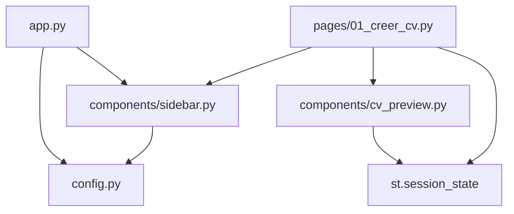

# Spécification Technique — US-00 : Page d'Accueil et Structure de Base

> **Auteur :** Architecte IA  
> **Sprint :** Sprint 1 — Échafaudage  
> **Statut :** 📐 En review

---

## 1. Objectif

Mettre en place l'**échafaudage complet** de l'application « Générateur de CV IA » :
- Structure de fichiers organisée
- Page d'accueil professionnelle
- Formulaire de saisie avec persistance (`st.session_state`)
- Navigation multi-pages Streamlit
- Configuration API via `.env`

---

## 2. Architecture de Fichiers

```
student_starter_pack/
├── .env                     # Clé API Gemini (GEMINI_API_KEY=...)
├── .env.example             # Template pour les contributeurs
├── .gitignore
├── requirements.txt         # Dépendances Python
├── src/
│   ├── app.py               # [NEW] Point d'entrée Streamlit
│   ├── config.py            # [NEW] Chargement de la configuration (.env)
│   ├── pages/
│   │   └── 01_creer_cv.py   # [NEW] Page formulaire "Créer mon CV"
│   └── components/
│       ├── sidebar.py       # [NEW] Barre latérale (navigation + config API)
│       └── cv_preview.py    # [NEW] Composant aperçu du CV
├── docs/
│   └── specs/
│       └── US00_spec.md     # Ce fichier
└── task.md
```

### Fichiers à créer

| Fichier | Rôle |
|---|---|
| `src/app.py` | Point d'entrée principal, page d'accueil |
| `src/config.py` | Chargement `.env`, accès à `GEMINI_API_KEY` |
| `src/pages/01_creer_cv.py` | Page formulaire multi-sections |
| `src/components/sidebar.py` | Sidebar : navigation + saisie clé API |
| `src/components/cv_preview.py` | Rendu visuel de l'aperçu CV |
| `requirements.txt` | Liste des dépendances |

### Fichiers à modifier

| Fichier | Modification |
|---|---|
| `.env.example` | Ajouter `GEMINI_API_KEY=your_key_here` si absent |

---

## 3. Librairies Nécessaires

| Librairie | Version | Justification |
|---|---|---|
| `streamlit` | `>=1.30.0` | Framework UI principal |
| `python-dotenv` | `>=1.0.0` | Chargement des variables `.env` |
| `google-generativeai` | `>=0.4.0` | Intégration future avec Gemini |

**`requirements.txt` :**
```
streamlit>=1.30.0
python-dotenv>=1.0.0
google-generativeai>=0.4.0
```

---

## 4. Détails d'Implémentation

### 4.1 `src/app.py` — Page d'accueil

- `st.set_page_config()` : titre, icône, layout `wide`
- Appel à `components.sidebar.render_sidebar()` pour la barre latérale
- Contenu principal :
  - Titre « 📄 Générateur de CV IA »
  - Sous-titre + description en 2-3 lignes
  - Bouton `st.button("🚀 Créer mon CV")` qui redirige vers la page formulaire via `st.switch_page()`
- Design soigné avec `st.markdown()` + CSS custom injecté

### 4.2 `src/config.py` — Configuration

```python
import os
from dotenv import load_dotenv

load_dotenv()

def get_api_key():
    return os.getenv("GEMINI_API_KEY", "")
```

### 4.3 `src/pages/01_creer_cv.py` — Formulaire

- Layout en 2 colonnes : formulaire (gauche) | aperçu (droite)
- Sections du formulaire via `st.expander()` ou `st.tabs()` :
  1. **Informations personnelles** : nom, email, téléphone, adresse, LinkedIn
  2. **Expériences** : liste dynamique (ajouter/supprimer) avec poste, entreprise, dates, description
  3. **Formations** : liste dynamique avec diplôme, établissement, année
  4. **Compétences** : saisie libre ou tags
- Toutes les données sont stockées dans `st.session_state["cv_data"]`
- Colonne droite : appel à `components.cv_preview.render_preview()`

### 4.4 `src/components/sidebar.py` — Barre latérale

```python
import streamlit as st
from config import get_api_key

def render_sidebar():
    with st.sidebar:
        st.title("📄 CV IA")
        st.markdown("---")
        # Navigation
        st.page_link("app.py", label="🏠 Accueil")
        st.page_link("pages/01_creer_cv.py", label="📝 Créer mon CV")
        st.markdown("---")
        # Configuration API
        api_key = st.text_input("🔑 Clé API Gemini", type="password",
                                value=get_api_key())
        if api_key:
            st.session_state["api_key"] = api_key
```

### 4.5 `src/components/cv_preview.py` — Aperçu

- Lit `st.session_state["cv_data"]`
- Affiche un rendu structuré du CV avec mise en forme markdown
- Affiche un message « Remplissez le formulaire pour voir l'aperçu » si données vides

---

## 5. Gestion de l'État (`st.session_state`)

```python
# Structure initialisée au démarrage
st.session_state.setdefault("cv_data", {
    "personal_info": {
        "name": "", "email": "", "phone": "",
        "address": "", "linkedin": ""
    },
    "experiences": [],    # Liste de dict {title, company, start, end, description}
    "education": [],      # Liste de dict {degree, school, year}
    "skills": []          # Liste de strings
})

st.session_state.setdefault("api_key", "")
```

---

## 6. Stratégie de Test

### 6.1 Tests automatisés

| # | Test | Commande | Résultat attendu |
|---|---|---|---|
| T1 | L'app démarre sans erreur | `streamlit run src/app.py --server.headless=true` | Pas d'exception, serveur démarré |
| T2 | Le fichier requirements.txt est installable | `pip install -r requirements.txt` | Installation sans erreur |
| T3 | Les imports fonctionnent | `python -c "from src.config import get_api_key"` | Pas d'ImportError |

### 6.2 Tests manuels (par le Product Owner via navigateur)

| # | Action | Vérification |
|---|---|---|
| M1 | Ouvrir `http://localhost:8501` | La page d'accueil s'affiche avec titre, sous-titre et bouton |
| M2 | Cliquer sur « 🚀 Créer mon CV » | Navigation vers le formulaire |
| M3 | Remplir les champs du formulaire | Les données apparaissent dans l'aperçu |
| M4 | Naviguer avec la sidebar | Les liens fonctionnent |
| M5 | Saisir une clé API dans la sidebar | La clé est sauvegardée dans la session |
| M6 | Revenir à l'accueil puis retourner au formulaire | Les données du formulaire sont toujours présentes |

### 6.3 Critères de validation

- ✅ Tous les tests T1-T3 passent
- ✅ Tous les scénarios M1-M6 sont validés manuellement
- ✅ Le design est jugé « professionnel » par le Product Owner

---

## 7. Dépendances entre fichiers



---

## 8. Risques & Décisions

| Risque | Mitigation |
|---|---|
| `st.switch_page()` nécessite Streamlit >= 1.30 | Version minimale imposée dans `requirements.txt` |
| Clé API visible en mémoire | Utilisation de `type="password"` + `.env` non versionné |
| Perte de données au rechargement | `st.session_state` persiste pendant la session active |
